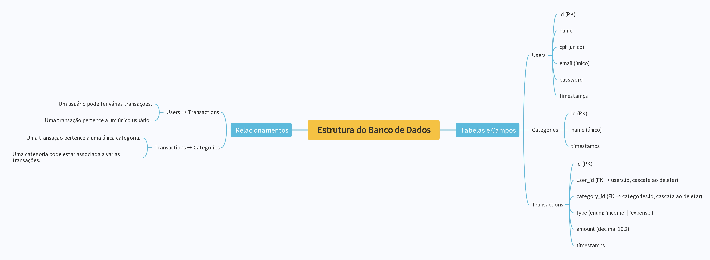

# VLAB Backend Challenge

Este projeto foi desenvolvido como parte do processo seletivo para a vaga de Back-end no VLAB.  
Ele implementa um sistema de **monitoramento financeiro**, permitindo o gerenciamento de **transações**, **categorias** e **usuários**, incluindo funcionalidades de **autenticação** e **documentação via Swagger**.

---

## Tecnologias Utilizadas

- **Laravel**
- **Docker** (para subir o banco de dados PostgreSQL)
- **PostgreSQL** 
- **Autenticação** (Laravel Sanctum)
- **Swagger** (documentação de API)
- **Migrations** (para criação e versionamento do schema do banco)

---

## Funcionalidades Implementadas

1. **Categorias de Transação**  
   - **Criar Categoria**: cadastra nome e ID.  
   - **Listar Categorias**: retorna todas as categorias com seus IDs.  
   - **Deletar Categoria**: remove a categoria via ID, lidando com relações em transações vinculadas.

2. **Transações**  
   - **Criar Transação**: registra usuário, tipo (recebeu ou pagou), valor e categoria.  
   - **Listar Transações**: mostra todas as transações do usuário autenticado.  
   - **Filtrar Transações**: permite filtrar por categoria, usuário ou tipo (recebeu/pagou).  
   - **Remover Transação**: deleta via ID.

3. **Usuários**  
   - **Cadastro de Usuário**: registra nome completo, CPF, data de cadastro, e-mail e senha.  
   - **Editar Usuário**: atualiza dados do usuário (nome, CPF, e-mail etc.) via ID.  
   - **Deletar Conta**: remove a conta do usuário via ID, considerando transações associadas.

4. **Autenticação (Extra)**  
   - Rotas de transações e categorias protegidas por autenticação (token Bearer).  

5. **Documentação via Swagger (Extra)**  
   - Endpoints documentados no padrão OpenAPI/Swagger.  
   - **Observação**: não é possível testar a autenticação (envio de token Bearer) diretamente pela interface do Swagger. Recomendamos testar manualmente via Postman/Insomnia.

6. **Migrations**  
   - Incluídas para criar as tabelas (usuários, categorias, transações).

## Observações Importantes

- As migrations estão incluídas para facilitar a criação e configuração das tabelas.  
- A imagem do diagrama ERD se encontra no repositório.  
- A documentação Swagger descreve todos os endpoints, mas não suporta o envio de token Bearer na interface. Use Postman/Insomnia para testes de autenticação.  
- As rotas retornam códigos de status HTTP apropriados (201, 200, 404, 401 etc.).

---

## Lista de Rotas

## Rotas da API

**Autenticação**

- **POST api/register**: Registra um novo usuário  
- **POST api/login**: Autentica um usuário  
- **POST api/logout**: Encerra a sessão do usuário autenticado

**Usuários**

- **GET api/users**: Lista todos os usuários  
- **GET api/users/{user}**: Obtém informações de um usuário específico  
- **PUT api/users/{user}**: Atualiza informações de um usuário específico  
- **DELETE api/users/{user}**: Remove um usuário específico

**Categorias**

- **GET api/categories**: Lista todas as categorias  
- **POST api/categories**: Cria uma nova categoria  
- **GET api/categories/{category}**: Obtém informações de uma categoria específica  
- **PUT api/categories/{category}**: Atualiza informações de uma categoria específica  
- **DELETE api/categories/{category}**: Remove uma categoria específica

**Transações**

- **GET api/transactions**: Lista todas as transações  
- **POST api/transactions**: Cria uma nova transação  
- **GET api/transactions/{transaction}**: Obtém informações de uma transação específica  
- **PUT api/transactions/{transaction}**: Atualiza informações de uma transação específica  
- **DELETE api/transactions/{transaction}**: Remove uma transação específica

## Modelo de Entidade-Relacionamento

<p align="center">  
    
</p>

A imagem acima representa o relacionamento das entidades Usuário, Categoria e Transação.

# Instalação e Configuração

## Requisitos

- **PHP** >= 8.0  
- **Composer** >= 2.x  
- **Docker** e **Docker Compose** (caso opte por usar o ambiente Docker)  
- **Git** (para clonar o repositório)  

---

## Alguns comandos para ajudar na configuração, mas no geral é uma criação de projeto padrão Laravel 11.

### 1. Clonar o repositório  
```bash
git clone https://github.com/yLukas077/Vlab_php.git
cd Vlab_php
```

### 2. Copiar o arquivo de exemplo `.env`  
```bash
cp .env.example .env
```

### 3. Ajustar variáveis de ambiente  
Edite o arquivo `.env` e certifique-se de que os valores para conexão com o banco de dados estão corretos:

```env
DB_CONNECTION=pgsql
DB_HOST=db
DB_PORT=5432
DB_DATABASE=vlab_db
DB_USERNAME=postgres
DB_PASSWORD=postgres
```

### 4. Subir os containers  
```bash
docker-compose up -d
```
Isso iniciará  o PostgreSQL.

### 5. Instalar as dependências do Laravel  
```bash
composer install
php artisan key:generate
php artisan migrate
```

### 6. Iniciar o servidor  
```bash
php artisan serve
```
O projeto ficará disponível em `http://localhost:8000`.

---

## Documentação da API (Swagger)

A documentação Swagger pode ser acessada em:  
```
http://localhost:8000/api/documentation
```

